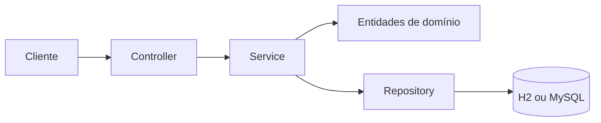

# API de Contas Bancárias

API REST desenvolvida para o desafio técnico de estágio em desenvolvimento Back-End da Pacto Mais.

O sistema gerencia correntistas, contas correntes, contas poupança e transações financeiras. As regras de negócio ficam encapsuladas nas entidades, enquanto os serviços coordenam persistência e registro das transações.

## Funcionalidades

- Cadastro, consulta, atualização e exclusão de correntistas
- Abertura e consulta de contas
- Depósitos e saques
- Extrato de transações por conta
- Limite para saque em conta corrente
- Bloqueio de saldo negativo em conta poupança
- Aplicação de juros sobre saldo negativo da conta corrente
- Aplicação de rendimento na conta poupança
- Validação das requisições
- Tratamento padronizado de erros
- Documentação interativa com Swagger
- Perfis para H2 e MySQL
- MySQL configurado com Docker Compose
- Testes unitários e de controllers

## Tecnologias

- Java 8
- Spring Boot 2.7.18
- Spring Web
- Spring Data JPA
- Hibernate
- Bean Validation
- H2 Database
- MySQL 8
- Docker Compose
- Springdoc OpenAPI
- JUnit 5
- Mockito
- Maven
- Lombok

## Pré-requisitos

Para executar com o perfil H2:

- JDK 8
- Maven 3.6 ou superior

Para executar com MySQL:

- Docker com Docker Compose
- JDK 8
- Maven 3.6 ou superior

## Como executar

### Clonar o projeto

```bash
git clone https://github.com/verickmr/bank-spring.git
cd bank-spring
```

### Executar com H2

O perfil H2 é utilizado por padrão e não exige a instalação de um banco de dados externo.

```bash
mvn spring-boot:run
```

A API estará disponível em:

```text
http://localhost:8080
```

O console do H2 estará disponível em:

```text
http://localhost:8080/h2-console
```

Utilize estas credenciais:

```text
JDBC URL: jdbc:h2:mem:bank
User Name: sa
Password:
```

### Executar com MySQL e Docker

Crie o arquivo local de variáveis de ambiente:

```bash
cp .env.example .env
```

Inicie o MySQL:

```bash
docker compose up -d mysql
```

Confira se o container está saudável:

```bash
docker compose ps
```

Execute a aplicação com o perfil MySQL:

```bash
mvn -Dspring-boot.run.profiles=mysql spring-boot:run
```

O schema é criado pelo script [`db/schema.sql`](db/schema.sql) quando o volume do MySQL é inicializado pela primeira vez.

Para encerrar o container:

```bash
docker compose down
```

## Documentação da API

Com a aplicação em execução, acesse:

- Swagger UI: <http://localhost:8080/swagger-ui/index.html>
- OpenAPI JSON: <http://localhost:8080/v3/api-docs>

A interface do Swagger permite consultar os contratos e executar requisições diretamente no navegador.

## Testes

Execute a suíte automatizada com:

```bash
mvn test
```

A suíte cobre regras de depósito, saque, juros, rendimento, validações e respostas dos controllers.

## Endpoints

As requisições com corpo devem utilizar o cabeçalho:

```text
Content-Type: application/json
```

### Correntistas

| Método | Endpoint | Descrição | Sucesso |
|---|---|---|---|
| `GET` | `/api/correntistas` | Lista todos os correntistas | `200 OK` |
| `GET` | `/api/correntistas/{id}` | Busca um correntista pelo ID | `200 OK` |
| `POST` | `/api/correntistas` | Cadastra um correntista | `201 Created` |
| `PUT` | `/api/correntistas/{id}` | Atualiza um correntista | `200 OK` |
| `DELETE` | `/api/correntistas/{id}` | Exclui um correntista | `204 No Content` |

#### Cadastrar um correntista

```http
POST /api/correntistas
```

```json
{
  "cpf": "12345678900",
  "nome": "Victor Erick",
  "email": "victor@email.com"
}
```

O CPF deve conter 11 dígitos e não pode pertencer a outro correntista.

### Contas

| Método | Endpoint | Descrição | Sucesso |
|---|---|---|---|
| `GET` | `/api/contas` | Lista todas as contas | `200 OK` |
| `GET` | `/api/contas/{id}` | Busca uma conta pelo ID | `200 OK` |
| `POST` | `/api/contas/{tipo}` | Abre uma conta | `201 Created` |
| `DELETE` | `/api/contas/{id}` | Exclui uma conta | `204 No Content` |
| `POST` | `/api/contas/{tipo}/{id}/depositar` | Realiza um depósito | `200 OK` |
| `POST` | `/api/contas/{tipo}/{id}/sacar` | Realiza um saque | `200 OK` |
| `POST` | `/api/contas/{tipo}/{id}/taxa` | Aplica juros ou rendimento | `200 OK` |

O parâmetro `{tipo}` aceita `corrente` ou `poupanca`.

#### Abrir uma conta corrente

```http
POST /api/contas/corrente
```

```json
{
  "numero": "0001-01",
  "limite": 500.00,
  "correntistaId": 1
}
```

#### Abrir uma conta poupança

```http
POST /api/contas/poupanca
```

```json
{
  "numero": "0001-02",
  "correntistaId": 1
}
```

Toda conta é aberta com saldo igual a zero. O saldo inicial não pode ser informado pelo cliente.

#### Realizar um depósito

```http
POST /api/contas/corrente/1/depositar
```

```json
{
  "valor": 1000.00
}
```

#### Realizar um saque

```http
POST /api/contas/corrente/1/sacar
```

```json
{
  "valor": 200.00
}
```

A conta corrente permite utilizar o saldo mais o limite. A conta poupança permite sacar somente o saldo disponível.

#### Aplicar juros ou rendimento

```http
POST /api/contas/corrente/1/taxa
```

```json
{
  "taxa": 0.02
}
```

A taxa é informada no formato decimal. Por exemplo, `0.02` representa 2%.

Para conta corrente, os juros são aplicados somente quando o saldo está negativo. Para conta poupança, a mesma operação aplica rendimento ao saldo. Ambas registram uma transação.

### Transações

| Método | Endpoint | Descrição | Sucesso |
|---|---|---|---|
| `GET` | `/api/transacoes` | Lista todas as transações | `200 OK` |
| `GET` | `/api/transacoes/conta/{contaId}` | Consulta o extrato de uma conta | `200 OK` |

#### Consultar o extrato

```http
GET /api/transacoes/conta/1
```

## Tratamento de erros

Os erros seguem uma estrutura padronizada:

```json
{
  "timestamp": "2026-09-24T15:30:00",
  "status": 422,
  "error": "Unprocessable Entity",
  "message": "Saldo insuficiente (saldo + limite).",
  "path": "/api/contas/corrente/1/sacar"
}
```

| Status | Situação |
|---|---|
| `400 Bad Request` | Corpo inválido, campos inválidos ou tipo de conta desconhecido |
| `404 Not Found` | Correntista ou conta não encontrado |
| `409 Conflict` | CPF já cadastrado |
| `422 Unprocessable Entity` | Violação de uma regra de negócio |

## Arquitetura



O projeto está organizado nas seguintes responsabilidades:

- **Controller:** recebe requisições, valida os dados de entrada e define as respostas HTTP.
- **Service:** coordena casos de uso, persistência e registro das transações.
- **Model:** representa o domínio e encapsula regras de depósito, saque, juros e rendimento.
- **Repository:** fornece acesso ao banco de dados com Spring Data JPA.
- **DTO:** define os contratos de entrada e saída da API.
- **Exception:** centraliza erros de negócio e respostas HTTP padronizadas.

### Decisões técnicas

- `Conta` é uma classe abstrata especializada por `ContaCorrente` e `ContaPoupanca`.
- A herança é persistida com a estratégia JPA `JOINED`.
- As regras financeiras ficam nas entidades para preservar o encapsulamento do domínio.
- Os serviços utilizam transações para manter a atualização do saldo e o registro da operação consistentes.
- O perfil H2 facilita a execução local e os testes.
- O perfil MySQL aproxima a aplicação de um ambiente real.
- O saldo inicial é sempre zero e só pode mudar por meio de uma operação financeira registrada.

## Escopo da entrega

Todos os requisitos obrigatórios foram implementados, incluindo gerenciamento de correntistas e contas, operações financeiras, persistência e extrato.

Também foram implementados os diferenciais sugeridos: rendimento da poupança, juros da conta corrente, testes automatizados, Swagger/OpenAPI e tratamento padronizado de erros.

Nenhum requisito obrigatório ou diferencial listado no desafio ficou pendente.

## Autor

**Victor Erick**

- GitHub: [verickmr](https://github.com/verickmr)
- E-mail: <verickmr.dev@gmail.com>
